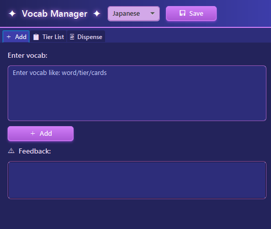

# Vocab Manager

A desktop application designed to help language learners organise vocabulary and generate targeted study batches.

## Overview

The application helps users prioritise vocabulary items based on importance and manage which words should be added to spaced repetition systems such as Anki.

## Features

- Store and organise vocabulary items
- Assign priorities to words
- Generate study batches based on priority
- Present vocabulary data through a JavaFX interface

## UI

## Technologies

- Java
- JavaFX

## Motivation

Created to improve my own language learning workflow by making vocabulary selection more systematic.
